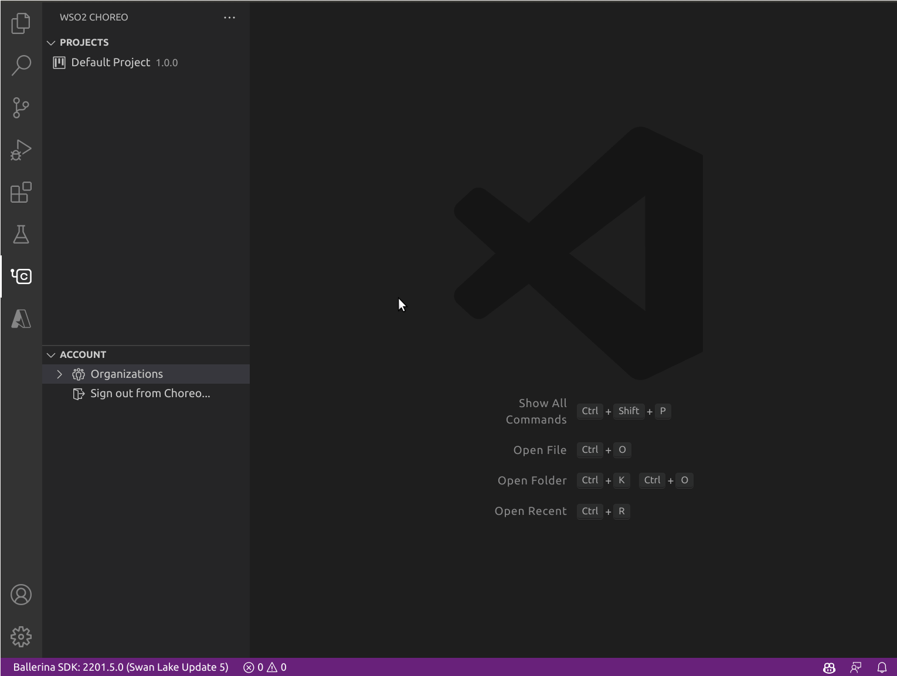
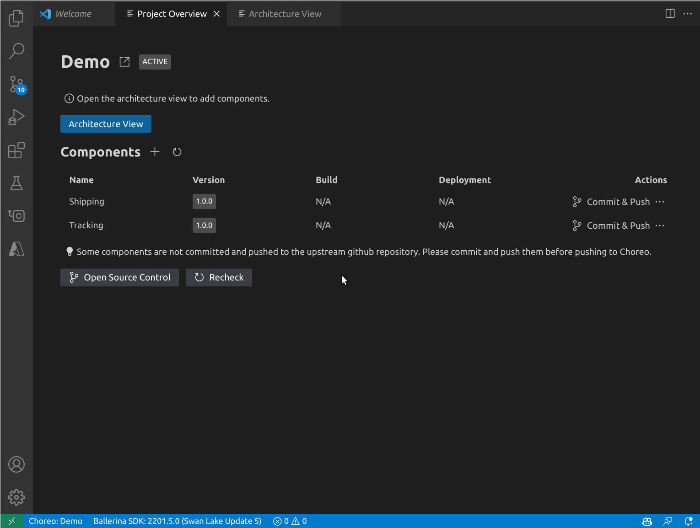

# Choreo for Visual Studio Code

The Choreo VS Code extension enhances your local development experience with Choreo projects by providing a wide range of project and component management capabilities. Learn more about [Choreo](https://wso2.com/choreo/docs/).

## Prerequisites
For a seamless development experience with the Choreo extension, ensure the following are configured in your local environment:

1. [Visual Studio Code](https://code.visualstudio.com/download) with the Choreo extension installed
2. [Ballerina Distribution](https://ballerina.io) Update 4 or later
3. [Ballerina Extension](https://marketplace.visualstudio.com/items?itemName=WSO2.ballerina) for VS Code, version 4.0.0 or later

## Getting Started
An active Choreo account is required to utilize the capabilities of the Choreo extension in the VS Code editor. If you already have a Choreo account, set up the extension by following these steps:

1. Install the Choreo extension from the [Visual Studio Code Marketplace](https://marketplace.visualstudio.com/) and wait for activation
2. Sign in to Choreo using one of the following methods:
    - Via the `Sign In` prompt displayed upon successful activation of the extension
    - Via the `Sign In` options available by clicking the Choreo icon on the activity bar of your VS Code editor

The above step redirects you to an external URI to complete the authentication process. If the sign-in is successful, all projects and organizations linked to your Choreo account will be visible in the Choreo activity panel, as shown below.

## Create a Project

If you already have a Choreo project, you can skip to the "Clone a Project" section. To create a new Choreo project directly from VSCode, follow these steps:

1. Run the Choreo: Create new project command or click the plus button next to the project list in the Choreo activity panel.

2. Complete the new project wizard, providing a GitHub repository if you want to use a monorepo for the project, where all components will be stored. You may be redirected to GitHub to authorize a repository to be linked to the project.

## Clone a Project

Cloning a project helps you to easily create a copy of your project in the local environment. To clone a project, follow these steps:

1. Go to the Choreo activity panel and select the project from the project list. The project overview will open, displaying the list of components for that project.

2. Click the clone button to clone the repository and the project locally. Select a directory to store the project.

3. Once the project is cloned, click "Open Project" to load it into VSCode. Each component will be available as a workspace item. If the project is already cloned, you can directly click the "Open project" button.

## Design and Develop Your Application

Once the project is opened from the project overview page, click the architecture diagram. Use the "Add Component" button to create components in the architecture view. You can also mark the interactions between components with the "Use APIs" link from the context menu.

The above step will create sources for each component locally in the given repo, and each component will be added as a workspace item in VSCode.

## Push Your Changes to Choreo

Once you've created the components, go to the project overview page. The project overview page will inform you that some of the components have not been pushed to the Git repo. You can go to the source control activity and commit and push the new component sources to the repo. Once you push the components, they will be visible on the Choreo platform. You can then click "Push Components to Choreo" which will upload the local components to the Choreo platform.

## Deploy Your Components

After creating the components, you can go to the component deploy page to deploy them. Once the components are deployed, you can view the build and deployment status from the project overview.

## Troubleshooting

For troubleshooting, see the Choreo output. To view the Choreo output tab, click **View**, click **Output**, and select **Choreo** from the output list.

## Ask for Help

Create [Github issues](https://github.com/wso2/choreo-vscode/issues) to reach out to us.
