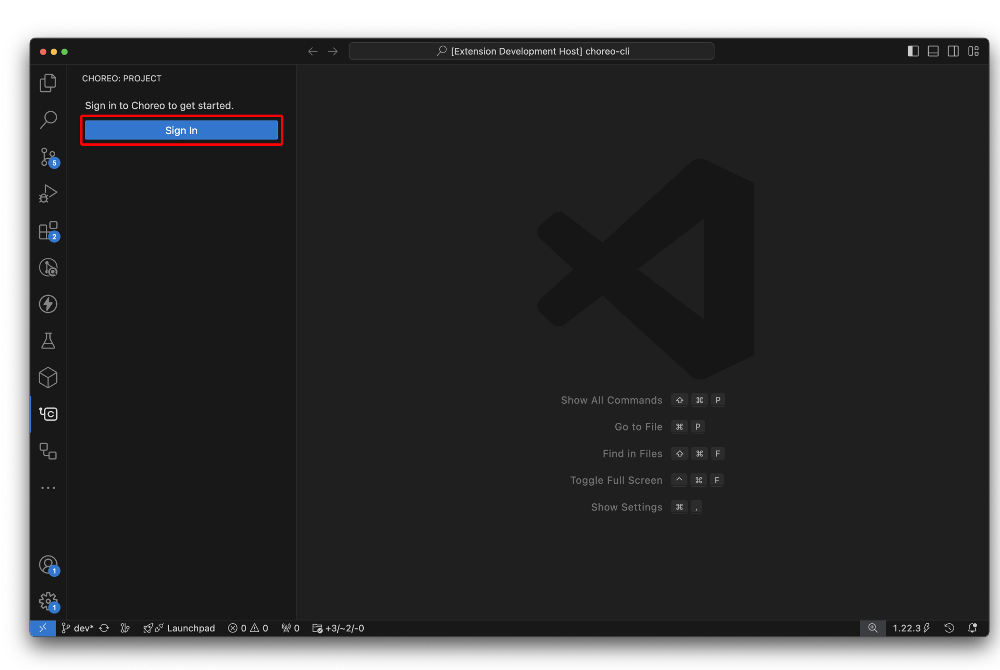
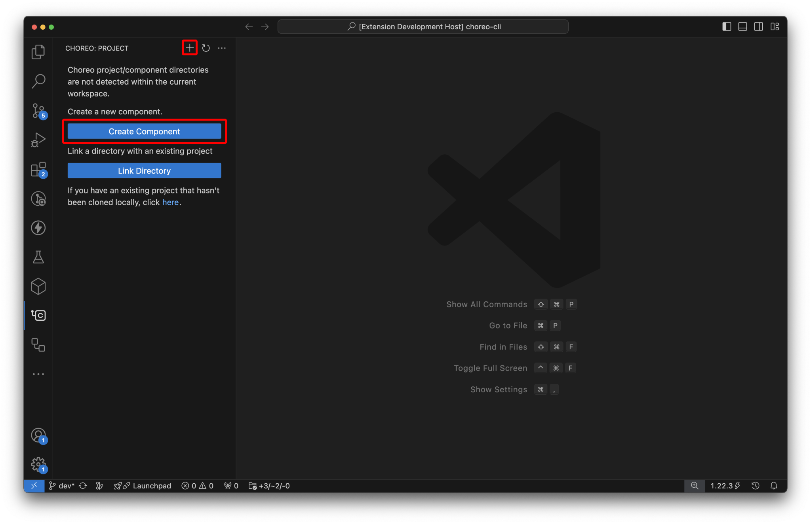

# Choreo Extension for Visual Studio Code

The Choreo VS Code extension enhances your local development experience with [Choreo projects](https://wso2.com/choreo/) by providing comprehensive project and component management capabilities. Learn more about [Choreo](https://wso2.com/choreo/docs/).

## Getting Started

To utilize the Choreo extension in the VS Code editor, you need an active Choreo account. Follow these steps to set up the extension:

1. Install the [Choreo VS Code extension](https://marketplace.visualstudio.com/items?itemName=WSO2.choreo) and wait for initialization.

2. Sign in to Choreo using one of the following methods:

   - Click the `Sign In` button within the Choreo activity panel.
   - Use the `Sign In` command provided by the Choreo extension.

   

> **Tip:** Upon successful sign-in, your account details will be visible in the user account view of the Choreo activity panel.

## Create and Manage Components

Follow these steps to create and manage Choreo components directly from VS Code:

1. In the Choreo activity panel, click the **Create Component** button or execute the **Create new component** command from the Command palette.

   

2. Select the organization and project for your component. You can also create a new project if needed.

3. Provide component details in the **New Choreo Component** pane and click **Create**.

   

> **Tip:** Ensure the selected directory is within a Git repository.

4. Once created, the component details view will open, and the Choreo activity panel will update with the new component.

   

> **Tip:** A `.choreo/context.yaml` file will be generated at the root of the Git repository directory to associate the directory with your Choreo project. If it's not available, regenerate it using the `Select Project` command.

5. The component details view allows various actions such as:
   - Trigger builds for selected commits
   - View lists of builds and their statuses
   - Diagnose build failures using build logs
   - Deploy builds in available environments
   - Access runtime logs to monitor deployed components
   - Test deployed components

## Discover Additional Features

Access a range of functionalities provided by the Choreo extension by opening the VS Code command palette and typing `Choreo`.

## Troubleshooting

To troubleshoot Choreo extension issues:

1. Open the **OUTPUT** pane by clicking **View** and then **OUTPUT** from the main menu.

2. Select **Choreo** from the drop-down menu on the right-hand side to view Choreo output for troubleshooting.

## Ask for help

Feel free to create [GitHub issues](https://github.com/wso2/choreo-vscode/issues) or reach us out on [Discord](https://discord.com/invite/wso2).
