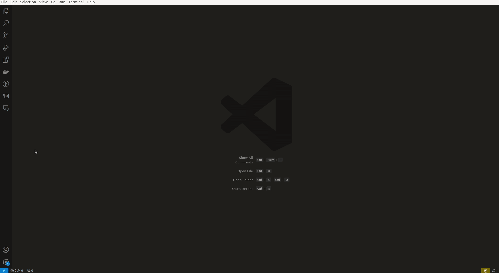
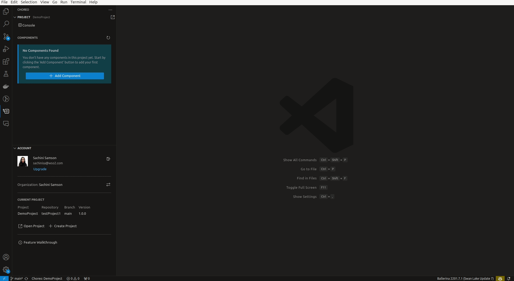
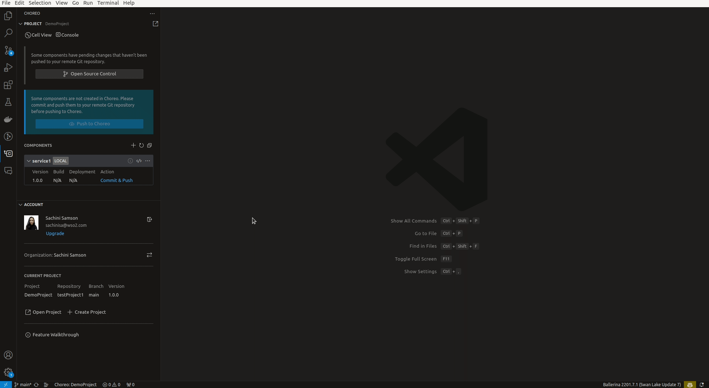

## ⚠️ Click [here](README_V2.md) for details on the upcoming version 2.0

 

# The Choreo extension for Visual Studio Code

The Choreo VS Code extension enhances your local development experience with [Choreo projects](https://wso2.com/choreo/) by providing a wide range of project and component management capabilities. Learn more about [Choreo](https://wso2.com/choreo/docs/).

## Get started

You need an active Choreo account to utilize the capabilities of the Choreo extension in the VS Code editor. If you already have a Choreo account, follow the steps below to set up the extension.

1. Install the [Choreo VS Code extension](https://marketplace.visualstudio.com/items?itemName=WSO2.choreo) and wait for the extension to be initialized.

2. Sign in to Choreo using one of the following methods.

   - Via the `Sign In` prompt displayed upon successful initialization of the extension
   - Via the `Sign In` options available by clicking the Choreo icon on the activity bar of your VS Code editor

   

> **Tip:** The above step redirects you to an external URI to complete the authentication process. If the sign-in is successful, the organization linked to your Choreo account will be visible in the Choreo activity panel.

## Create a project

Follow the steps below to create a new Choreo project directly from VS Code.

> **Tip:** If you already have a Choreo project, you can skip this section and move to the [Open Project](#open-project) section.

1. In the Choreo activity panel, click the **Create Project** button to create a new project.

   > **Tip:** Alternatively, execute the **Create new project** command in the Command palette.

2. In the **New Choreo Project** pane, complete the new project wizard by specifying appropriate values for the required fields.

   > **Tip:** If you want to use a single repo to store all the components of the project, select the **Mono repository** option, and provide a GitHub **Repository** and its **Organization**. This will redirect you to GitHub to authorize a repository to link it to the project.

## Open project

Follow the step below to open an exisiting Choreo project and create a copy of it in the local environment.

1. Click **Open Project** button to get the project list present in your organization.

2. In the Command palette, select the project from the **PROJECTS** list.

3. Select a directory in your local machine to store the project.

   > **Tip:** Once the project is cloned, it opens as a workspace in VS Code. Each component will be available as a workspace item.

## Design and develop your application

Follow the steps below to design and develop your application by adding components to it.

> **Info:** This creates the sources for each component locally in the given repo, and each component will be added as a workspace item in VS Code. To sync your local changes with the Choreo console, you'll need to perform a [push your changes to Choreo](#push-your-changes-to-choreo) step. This will update the Choreo console with the latest version of your components.

1. In the Choreo activity panel, click **Add Component** button.

2. Specify appropriate values for the required fields to create the new component.

3. Once the component is created, **Cell View** is enabled.

4. Click **+** icon in components section to create components.

The above step will create sources for each component locally in the given repo, and each component will be added as a workspace item in VS Code.

## Push your changes to Choreo

Follow the steps below to push the changes to Choreo after creating the components.

1. In the Component pane, expand the component you need to push to Choreo.

2. Under Action section, select **Commit and Push** option.

3. Add the respective changes, enter an appropriate commit message, and click **Commit** to commit the changes.

4. Once all the componets are commited, **Push to Choreo** option will be made available.

5. Click **Push to Choreo** to upload the components to the Choreo platform.

   > **Info:** Once you push the components, they will be visible on the Choreo platform.

## Deploy your components

After creating the components, follow the steps below to deploy your components.

1. In the [Choreo Console](https://console.choreo.dev/), navigate to the **Deploy** page, to deploy the components. Learn more about [Builds and Deployments](https://wso2.com/choreo/docs/devops-and-ci-cd/builds-and-deployments/)

2. Once the components are deployed, view the build and deployment status from the Choreo activity panel.

## Troubleshoot

Follow the steps below to troubleshoot Choreo extension issues.

1. From the main menu, Click **View** and Click **OUTPUT** to open the **OUTPUT** pane.

2. From the drop-down menu on the RHS, select **Choreo** to view the Choreo output for troubleshooting.

## Ask for help

Create [Github issues](https://github.com/wso2/choreo-vscode/issues) to reach out to us.
