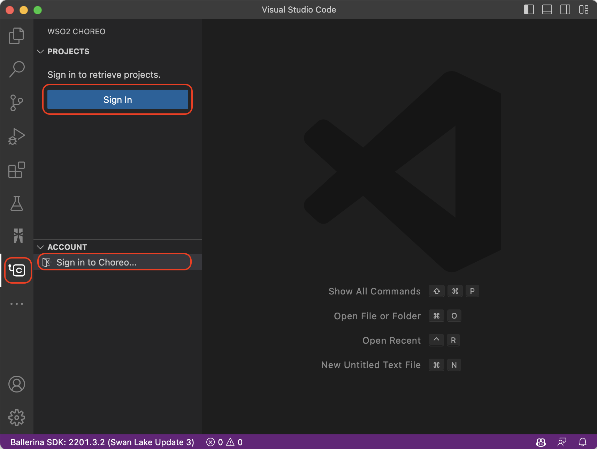

# Choreo for Visual Studio Code

The Choreo VS Code extension provides a range of Choreo **project** and **component** management capabilities to enrich the local development experience of Choreo projects. Learn more about [Choreo](https://wso2.com/choreo/docs/).

## Pre-requisites
For a seamless development experience with the Choreo extension, you need to have the following configured in your local environment.
1. [Visual Studio Code](https://code.visualstudio.com/download) with the Choreo extension installed
2. [Ballerina Extension](https://marketplace.visualstudio.com/items?itemName=WSO2.ballerina) for VS Code, version 4.0.0 or later

## Getting Started

You will require an active Choreo account to use the capabilities of the Choreo extension in the VS Code editor. If you have a Choreo account, you can set up the extension by following the steps below.
1. Install the Choreo extension from the [Visual Studio Code Marketplace](https://marketplace.visualstudio.com/) and await activation
2. Sign in to Choreo using one of the following approaches:
    -   Via the `Sign In` prompt that is displayed on successful activation of the extension
    -   Via the `Sign In` options available when you click on the Choreo icon on the activity bar of your VS Code editor

The above step redirects you to an external URI to complete the authentication process. If the sign-in is successful, all the projects and organizations linked to your Choreo account will be visible on the Choreo activity panel, as shown below.

Henceforth, you can experience the capabilities of the Choreo extension.

## Features

The main functionalities of this extension are listed below.

### Choreo project management

You can manage your projects in Choreo from your developer environment in the VS Code editor as follows:

#### Create a Choreo project

The Choreo extension allows you to create new projects in Choreo through the VS Code editor. You can use one of the following approaches:

-   Via the `Choreo: Create New Project` command available in the VS Code command palette
    

-   Via the Choreo activity panel, by clicking the plus icon in the project tree view
    

The above actions will open up a separate VS Code webview panel, where you can fill in the details of the new Choreo project. You can fill in the primary project details and configure a GitHub repository for the project. You can either choose an existing repository or configure a new one.

After filling in the required details and configuring the repository, you can click **Create** to create the project. Upon successful creation, you are redirected to a separate webview containing an overview of the project. Furthermore, this newly created project will also be reflected on the project tree view of the Choreo activity panel.

#### Clone Choreo projects

By cloning a Choreo project, you are downloading a copy of the Choreo project to your local development environment. This option is not restricted to projects created only via the Choreo extension: it is available for all Choreo projects linked to your Choreo account.

You can clone a project by selecting the respective project in the project tree view of the Choreo activity panel. This action opens the **Project Overview** panel that displays basic project-related details, including those of the components. Via this overview, you can click **Clone Project** to get the local copy of the project. If the cloning is successful, you are automatically redirected to a new VS Code workspace containing the project.

If the project you select on the VS Code editor is one that is cloned to the local environment, you are notified of the same, as shown below. Hence, you can directly access the project workspace by clicking **Open Project**.

### Choreo component management

You can manage the components in Choreo from the VS Code editor as follows:

#### Create new components

The Choreo extension allows you to create new Choreo components from the VS Code editor. You can use one of the following approaches:

-   Via the `Choreo: Create New Component` command available in the VS Code command palette
    

-   Via the **Project Overview** panel, by clicking the plus icon in the components section

The above options will open up a separate VS Code webview panel, where you can fill in the details of the new Choreo component. You can fill in the primary component details and configure the GitHub repository. Similar to project creation, you can either choose an existing repository or configure a new one.

After filling in the required details and configuring the repository, you can click **Create** to create the component. This generates a basic template for the selected component type, and you will see the changes reflected under the **Components** section of the **Project Overview** panel.

You can then use the **Open Source Control** option to review the changes made by creating the new component. Once done, you can push the changes to your configured GitHub repository.

If the changes are successfully synced, you will be able to directly update your Choreo projects using the **Push to Choreo** option.

#### Develop Choreo components

By cloning projects, you can directly access the complete Choreo project and start developing Choreo components. In addition to creating and managing new components, as mentioned above, you will have access to local copies of existing Choreo components, which you can use to work on Choreo projects seamlessly.

### Visualizing the architecture of Ballerina components inside Choreo projects

The Choreo extension allows you to visualize the architecture of the Ballerina components inside Choreo projects. To access this feature, you also need to install the [Ballerina Extension](https://marketplace.visualstudio.com/items?itemName=WSO2.ballerina) for the VS Code editor.

Once the Ballerina extension is installed, you can visualize the architecture of Ballerina components by selecting **View Architecture** in the **Project Overview** panel. This opens up a view through which you can access a high-level view of the components in the project, their interactions, and their exposure via the service diagrams and cell diagrams.

## Troubleshooting

For troubleshooting, see the Choreo output. To view the Choreo output tab, click **View**, click **Output**, and select **Choreo** from the output list.

## Ask for Help

Create [Github issues](https://github.com/wso2/choreo-vscode/issues) to reach out to us.
