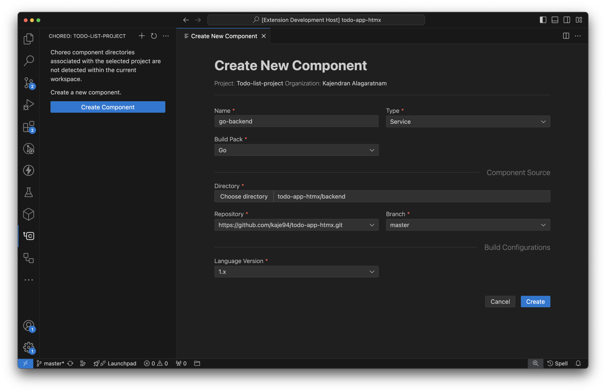

# Choreo Extension for Visual Studio Code

The Choreo VS Code extension enhances your local development experience with [Choreo](https://wso2.com/choreo/) projects, providing comprehensive project and component management capabilities in VS Code. For more details, visit the [Choreo documentation](https://wso2.com/choreo/docs/).

## Getting Started

1. [Create an account on Choreo](https://console.choreo.dev/).
2. Install the [Choreo VS Code extension](https://marketplace.visualstudio.com/items?itemName=WSO2.choreo).
3. Sign in to Choreo via VS Code (see screenshot below).

## Feature List

- **Manage Projects**: Work with Choreo [projects](https://docs.dv.choreo.dev/choreo/docs/choreo-concepts/project/) directly in your VS Code workspace.
- **Create Components**: Generate [components](https://wso2.com/choreo/docs/choreo-concepts/component/) linked to your application source.
- **Trigger Builds**: Initiate builds for your components in the cloud and view the build logs.
- **Deploy Builds**: Deploy your component builds to any chosen [environments](https://wso2.com/choreo/docs/choreo-concepts/environments/).
- **Monitor Components**: Access runtime logs to monitor your deployed components.
- **Test Services**: Verify the functionality of publicly exposed services.

## Screenshots

|  |
| :-----------------------------------------------------------: |
|                _Sign in to Choreo via VS Code_                |

 

|  |
| :-------------------------------------------------------------------------: |
|                          _Component creation form_                          |

 

|  |
| :-----------------------------------------------------------------------------------------: |
|                                  _Component details view_                                   |

## Discover Additional Features

Access a range of functionalities provided by the Choreo extension by opening the VS Code command palette and typing `Choreo`.

## Troubleshooting

To troubleshoot Choreo extension issues:

1. Open the **OUTPUT** pane by clicking **View** and then **OUTPUT** from the main menu.
2. Select **Choreo** from the drop-down menu on the right-hand side to view Choreo output for troubleshooting.

## Get Help

Feel free to create [GitHub issues](https://github.com/wso2/choreo-vscode/issues) or reach out to us on [Discord](https://discord.com/invite/wso2).
